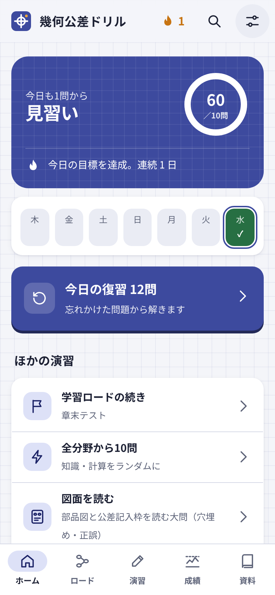
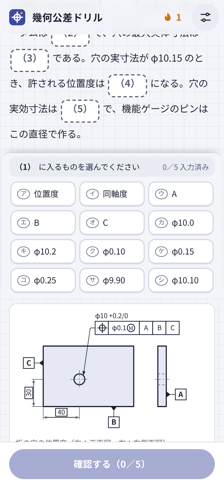
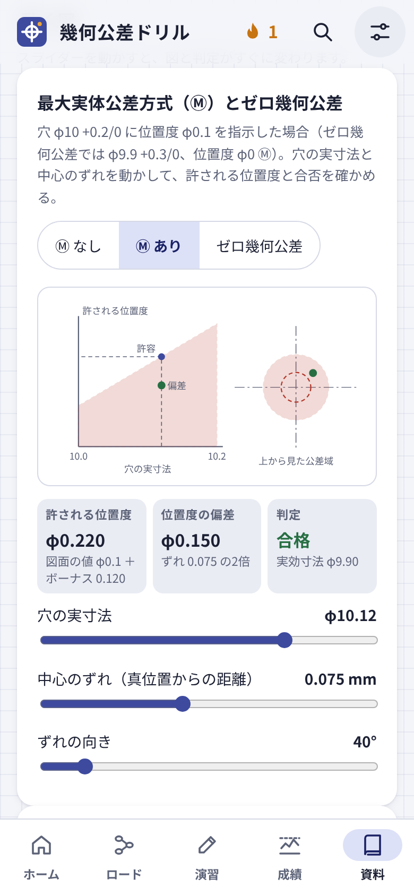
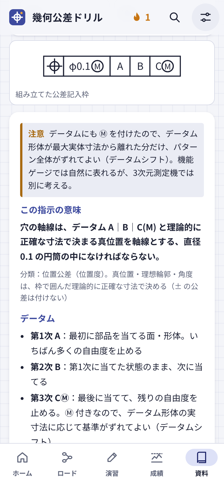

# 幾何公差ドリル

図面の幾何公差（GD&T）を、スマートフォンで毎日少しずつ学べる学習アプリです。JIS B 0021 を主軸に、記号・データム・位置度・最大実体公差方式から、検図・測定・海外の図面（ISO・ASME）まで扱います。ブラウザで使う Web 版と、Android アプリ版があります。無料で、広告もありません。

**[▶ Web 版を開く](https://kotaooka.github.io/gdt-drill/)**　｜　**[⬇ Android アプリ（APK）をダウンロード](https://github.com/kotaooka/gdt-drill/releases/latest)**

## 特長

- **図面の文法から実務まで順に進める「学習ロード」**　記号と公差記入枠の読み方から、データム、最大実体公差方式、測定と検査、海外の図面まで、9つの章・26のステージを物語仕立てで進めます。
- **図を見て解く5種類の問題**　知識・計算に加えて、部品図を読む大問、要求から公差記入枠を組み立てる問題（ASME の複合位置度を含む）、図面の誤りを見つけて直す検図。
- **計算問題は毎回数値が変わる**　位置度の偏差、Ⓜ のボーナス公差、ゼロ幾何公差、振れ、普通幾何公差（JIS B 0419）、公差の積み上げ、測定値からの合否判定など28種。解答中に電卓と早見表を開けます。
- **動く図と「記入枠を読む」**　スライダーで穴の大きさや位置を動かし、公差域と合否の変わり方を目で確かめられます。公差記入枠を組むと、指示の意味・公差域・データムの役割・測り方を示し、φ・Ⓜ・データムの付け方の誤りを指摘します。
- **実務のケース**　検査成績書の誤判定を見抜く問題や、図面の指示が足りずに不良が通ってしまう例を扱います。
- **実力診断**　全分野から約40問。分野・項目ごとの正答率と弱い項目が分かり、そのまま演習に進めます。結果は1枚の画像で保存でき、出題コードを使えば何人でも同じ問題で受けられます。
- **忘れたころに出し直す復習**　正解するたびに次の出題までの間隔を延ばし（1日→3日→7日→…）、間違えた問題はその日の復習に戻します。
- **毎日続けやすい**　1日の目標問題数、連続記録、実績（バッジ）、記号を早押しで答える「記号フラッシュ」。Android 版では毎日のリマインダー通知。

## はじめかた

### Web 版（パソコン・iPhone・Android）

1. [https://kotaooka.github.io/gdt-drill/](https://kotaooka.github.io/gdt-drill/) を開きます。
2. 初回だけ、1日の目標・文字サイズを選ぶ案内が出ます。
3. ホーム画面に追加すると、アプリのように起動できます。
   - Android（Chrome）：設定（右上）→「ホーム画面に追加」、またはブラウザのメニューの「アプリをインストール」
   - iPhone（Safari）：共有ボタン →「ホーム画面に追加」

一度開いたあとは、通信がなくても起動して解けます。解答記録はブラウザの中に保存されます。

### Android アプリ版

1. Android で [Releases の最新版](https://github.com/kotaooka/gdt-drill/releases/latest) を開き、「Assets」の **gdt-drill.apk** をタップしてダウンロードします。
2. ダウンロードしたファイルを開き、「インストール」をタップします。
   - 「提供元不明のアプリ」の確認が出たら、ダウンロードに使ったアプリ（Chrome など）にインストールを許可してください。Google Play を経由しないアプリのため、初回だけ必要です。
3. ホーム画面の「幾何公差ドリル」から起動します。
4. 毎日の通知を使う場合は、設定（右上）→「毎日のリマインダー」をオンにし、通知を許可します。

**更新するとき**：新しい版の gdt-drill.apk を同じ手順で入れると、上書きインストールされます。解答記録は引き継がれます。

> APK は、このリポジトリの Releases から入手したものだけをインストールしてください。

## 使い方

| 画面 | できること |
|---|---|
| ホーム | 今日の目標と連続記録。いちばん大きなボタンで「今日の復習」か「学習ロードの続き」を始めます。図面を読む・記入枠を組む・検図・合否判定・記号フラッシュもここから |
| ロード | 章ごとのステージ。10問のレッスンを7割以上で2回クリアすると次へ。章末テスト（8割以上）で次の章へ |
| 演習 | 分野・問題の種類（知識／計算／図面を読む／記入枠を組む／検図）を選んで演習。実力診断（約40問・時間制限なし）もここから |
| 成績 | 総合と分野ごとの正答率（分野を開くと分類ごと）、実績、復習の予定、記録の書き出し・読み込み |
| 資料 | 出題範囲との対応表（項目ごとの問題数と演習）、関連規格、早見表（記号・付加記号・普通幾何公差・規格の違い・比較・公式）、動く図、記入枠を読む |

- 問題は、選択肢を選んでから「確認する」で採点します。大問は、本文の空欄をすべて埋めてからまとめて採点します。選択肢は画面の下に固定されるので、本文や図をスクロールしながら選べます。
- 解答中は、上部のボタンで電卓と早見表を開けます。
- 右上の虫めがねで、問題・解説・早見表・関連規格を言葉で探せます（MMC・CMM などの略語でも探せます）。
- 通常の演習は、途中でやめると進み具合がリセットされます（解答済みの正誤は記録に残ります）。実力診断だけは途中で閉じても、「続きから再開」で戻れます。
- 解説の下の「☆ あとで見る」で問題を登録すると、ホームの「あとで見る」からまとめて解けます。
- 問題や解説の誤りに気づいたら、解説の下の「誤りを報告」から知らせてください。「GitHub で報告」を押すと、問題の内容を書き込んだ報告ページ（Issue）が開きます（GitHub のアカウントが必要）。
- 設定（右上）：テーマ（ライト／ダーク）、文字サイズ、効果音、バイブレーション、1日の目標、通知、更新の確認。

## 収録内容

| 種類 | 数 |
|---|---|
| 知識問題 | 181問（6分野・19分類） |
| 計算・判定問題 | 28種（出題のたびに数値が変わる。測定値から合否を判定する問題を含む） |
| 大問 | 49題・196問（図面を読む17題、記入枠を組む17題、検図15題。実務のケースを含む） |
| 学習ロード | 9章・26ステージ |

出題範囲は、作成者が JIS の幾何公差関連規格をもとに決めた69項目で、資料タブで項目ごとの問題数と正答率を確認できます。扱う規格は次のとおりです。

| 位置づけ | 規格 |
|---|---|
| 主軸 | JIS B 0021（幾何公差表示方式） |
| 関連 | JIS B 0419（普通幾何公差）、JIS B 0025（位置度公差方式）、JIS B 0024（独立の原則）、JIS B 0026（非剛性部品）、JIS B 0641-1（合否判定）、JIS B 0680（標準温度） |
| 違いを扱う | ISO 1101:2017、ISO 5458:2018、ASME Y14.5-2018 |

計算問題の正解は、問題文の数値から独立に計算し直すプログラムで照合しています。

## よくある質問

**解答記録はどこに保存されますか？**
使っている端末の中（Web 版はブラウザ、アプリ版はアプリ内）だけです。サーバーには送信しません。

**機種変更やブラウザを変えるときは？**
成績タブの「書き出す」で記録をテキストにして控え、新しい端末の「読み込む」に貼り付けると引き継げます。アプリ版と Web 版の間でも移せます。

**新人教育で、全員に同じ問題を解かせたいときは？**
実力診断の「出題コードで受ける」を使います。講師が英数字のコード（例：`SHINJIN26`）を決めて伝えると、だれが受けても同じ問題・同じ数値・同じ選択肢の順になります。結果は「画像で保存」で、氏名・コード・分野ごとの正答率が入った1枚の画像にできます。アプリの版が違うと問題が変わることがあるので、全員が同じ版を使ってください。

**会社のスマートフォンで使えますか？**
APK をインストールできない端末でも、Web 版ならブラウザで使えます。

**iPhone で使えますか？**
Web 版が使えます。通知とバイブレーションは使えません。

**問題や解説に誤りを見つけたら？**
解説の下の「誤りを報告」でメモを残せます（成績タブで一覧・コピーできます）。[Issues](https://github.com/kotaooka/gdt-drill/issues) に書き込んでいただければ修正します。

**通知が届きません。**
Android の設定 → アプリ →「幾何公差ドリル」→ 通知 が許可されているか確認してください。電池の最適化の影響で、数分遅れて届くことがあります。その日の目標を達成済みの日は通知しません。

## 注意事項

- 本アプリは個人が作成した**非公式**の学習教材です。日本規格協会・ISO・ASME とは関係ありません。
- 問題・解説・図はすべてオリジナルで、規格の本文や図は転載していません。
- 内容の正確さには注意していますが、誤りが含まれる可能性があります。実務で判断するときは、規格の最新の原文で確認してください。

## 開発者向け

ビルド・テスト・問題の追加方法・リリース手順は [DEVELOPMENT.md](DEVELOPMENT.md) を参照してください。

## ライセンス

[MIT License](LICENSE)
