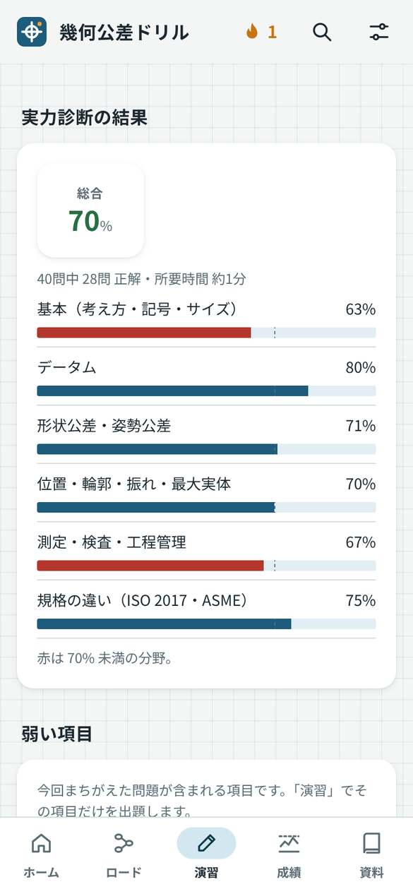

# 幾何公差ドリル

**図面の幾何公差を、スマートフォンで毎日少しずつ。**
JIS B 0021 を軸に、記号・データム・位置度・最大実体公差方式から、検図・測定・海外の図面（ISO・ASME）まで、図を見ながら解いて身につける問題集です。

**[▶ Web 版を開く](https://kotaooka.github.io/gdt-drill/)**　｜　**[⬇ Android アプリ（APK）](https://github.com/kotaooka/gdt-drill/releases/latest)**

<table>
  <tr>
    <td align="center" width="25%"> 毎日の目標と復習</td>
    <td align="center" width="25%"> 図面を読む問題</td>
    <td align="center" width="25%"> 記入枠を読む</td>
    <td align="center" width="25%"> 実力診断</td>
  </tr>
</table>

## こんな人に

- 図面の公差記入枠を、自信をもって読めるようになりたい設計・品質保証・検査の担当者
- 新人に幾何公差を教える人（同じ問題を配って、結果を比べられます）
- 海外の図面で、JIS との読み方の違いを押さえておきたい人

## できること

### 学ぶ
- **学習ロード**：図面の文法から、最大実体公差方式、測定と検査、海外の図面まで、9章のストーリーで順に進めます。
- **5種類の問題**：知識・計算・図面を読む・記入枠を組む・検図。分野と種類を選んで演習できます。
- **計算問題は毎回数値が変わる**ので、答えを覚えるのではなく、解き方が身につきます。
- **間隔をあけた復習**：まちがえた問題や忘れかけた問題を、ちょうどよい間隔で出し直します。

### 図で考える
- **図面を読む・記入枠を組む**：部品図と公差記入枠を見て答えます。「この穴をこう規制したい」という要求から、記号・公差値・データムの順を選んで枠を完成させます。複数段の枠（ASME の複合位置度）も扱います。
- **動く図**：スライダーで穴の大きさや位置を動かし、Ⓜ のボーナス公差、位置度の円と座標の正方形の違い、公差の積み上げを目で確かめられます。
- **記入枠を読む**：公差記入枠を組むと、指示の意味・公差域・データムの役割・測り方を文章で示します。φ・Ⓜ・データムの付け方がおかしければ指摘します。

### 実務で使う
- **検図**：φ の付け忘れ、データムの順序、± 寸法との併用など、図面の誤りを見つけて直します。
- **合否を判定する**：3次元測定機の座標やダイヤルゲージの読みから、合格か不合格かを判断します。
- **実務のケース**：検査成績書の誤判定を見抜く問題と、図面の指示が足りずに不良が通ってしまう例を扱います。
- **組付けと工程管理**：実効寸法によるすき間、公差の積み上げ（最悪値法・RSS）、データムシフト、工程能力、測定の不確かさ。

### 力を測る・続ける
- **実力診断**：全分野から約40問。分野・項目ごとの正答率と弱い項目が分かり、そこから演習に進めます。結果は1枚の画像で保存できます。
- **記号フラッシュ・実績**：14の記号をタイムを競って答えるミニゲームと、節目でもらえるバッジ。
- **すぐ引ける資料**：記号一覧、付加記号、普通幾何公差（JIS B 0419）、規格の違い、まちがえやすい組み合わせの比較表、公式集。右上の虫めがねで、問題・解説・資料を横断して検索できます。

## 収録内容

| 種類 | 数 | 内容 |
|---|---|---|
| 知識問題 | 181 問 | 記号・データム・公差域・規格の違い・測定など |
| 計算・判定問題 | 28 種 | 位置度の偏差、ボーナス公差、ゼロ幾何公差、振れ、普通幾何公差、積み上げ、合否判定など。毎回数値が変わる |
| 図面を読む | 17 題 | 部品図と公差記入枠についての穴埋め・正誤 |
| 記入枠を組む | 17 題 | 要求から公差記入枠を組み立てる（複数段を含む） |
| 検図 | 15 題 | 図面の誤りを見つけて直す（実務のケースを含む） |
| 学習ロード | 9 章・26 ステージ | 章末テストつき |

## 扱う規格

| 位置づけ | 規格 |
|---|---|
| 主軸 | JIS B 0021（幾何公差の図示方法） |
| 関連 | JIS B 0419（普通幾何公差）、JIS B 0025（位置度）、JIS B 0024（独立の原則）、JIS B 0026（非剛性部品）、JIS B 0641-1（合否判定）、JIS B 0680（標準温度） |
| 違いを扱う | ISO 1101:2017、ISO 5458:2018、ASME Y14.5-2018 |

## はじめかた

**Web 版**
[こちら](https://kotaooka.github.io/gdt-drill/)を開くだけです。スマートフォンでは「ホーム画面に追加」すると、アプリのように起動でき、オフラインでも使えます。

**Android アプリ**（Android 8.0 以上）
1. [最新版のリリース](https://github.com/kotaooka/gdt-drill/releases/latest)を開き、「Assets」の **gdt-drill.apk** をダウンロードします。
2. ダウンロードしたファイルを開いてインストールします。初回は「提供元不明のアプリ」の許可を求められます。
3. 新しい版も同じ手順で入れると上書きされ、解答の記録は引き継がれます。

アプリ版では、毎日の学習のリマインダー通知を設定できます。

## 教育で使う

実力診断の **出題コード** を使うと、何人が受けても同じ問題・同じ数値・同じ選択肢の順になります。

1. 講師が英数字のコード（例：`SHINJIN26`）を決めて、受講者に伝えます。
2. 受講者は「演習」→「実力診断」→「出題コードで受ける」にコードを入れて受けます。
3. 結果の画面で「画像で保存」を押すと、氏名・コード・分野ごとの正答率が入った画像ができます。これを集めれば、結果を並べて比べられます。

アプリの版が違うと、同じコードでも問題が変わることがあります。全員が同じ版を使ってください。

## データの扱い

- 解答の記録は、使っている端末の中だけに保存します。外部には送信しません。
- 外部と通信するのは、設定の「更新の確認」で GitHub から最新版の番号を読むときだけです。
- 機種変更のときは、設定の「記録の書き出し・読み込み」で記録を移せます。

## 誤りの報告

解説の下の「誤りを報告」から、[Issues](https://github.com/kotaooka/gdt-drill/issues) に送れます。問題の内容や解説の誤り、分かりにくい表現など、気づいた点をお寄せください。

## ご注意

- 個人が作成した非公式の学習教材です。日本規格協会・ISO・ASME とは関係ありません。
- 問題・解説・図はすべてオリジナルで、規格の本文や図は転載していません。実務で判断するときは、必ず規格票の原文を確認してください。

---

開発者向けの情報（構成・ビルド・問題の追加・リリース手順）は [DEVELOPMENT.md](DEVELOPMENT.md) にあります。
